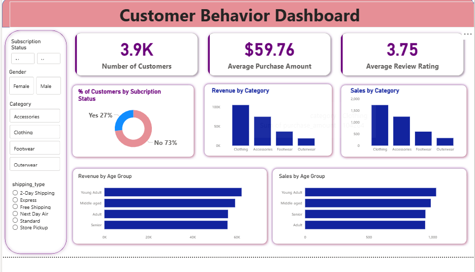

# Customer Behavior Analysis — Premium Dashboard & EDA

Professional, skill-focused repository showcasing an end-to-end exploratory data analysis (EDA) and interactive dashboard built to surface actionable insights into customer shopping behavior.

---

Table of Contents
- Project Overview
- Skills Demonstrated
- Dataset Summary
- Analysis & Preprocessing
- Visualizations & Dashboard
- Key Findings & Business Recommendations
- How to run
- Notebook walkthrough
- License & Contact

---

Project Overview
----------------
This repository contains a polished exploratory analysis and an interactive customer behavior dashboard built from a retail-style dataset (customer shopping behavior). The deliverable is designed for analysts, product managers, and stakeholders who need a concise, high-value view of customer segments, purchasing trends, and revenue drivers.

The provided dashboard (screenshot above) is a premium-quality visualization that highlights:
- Total customers, average purchase amount, and average review rating
- Subscription breakdown and conversion indicators
- Revenue and sales by category and age group
- Filter controls for subscription status, gender, category, and shipping type

Skills Demonstrated
-------------------
- Data wrangling with pandas
- Missing-value imputation (group-wise median imputation)
- Feature engineering (age bucketing / quantile-based age groups)
- Descriptive statistics and segmentation
- Aggregation & group analysis (revenue, sales, frequency)
- Dashboard design and visualization (bar charts, donut charts, KPI cards)
- Reproducible Jupyter notebook workflow

Dataset Summary
---------------
- Source: customer_shopping_behavior.csv (included in repo or provided as a local download)
- Records: ~3,900 customer transactions
- Key columns: customer_id, age, gender, item_purchased, category, purchase_amount, location, size, color, season, review_rating, subscription_status, shipping_type, discount_applied, promo_code_used, previous_purchases, payment_method, frequency_of_purchases

Analysis & Preprocessing
------------------------
- Data inspection with df.info() and df.describe()
- Missing values detected only in `review_rating` (37 missing). These are filled per-category using median review within each category:
  df['review_rating'] = df.groupby('category')['review_rating'].transform(lambda x: x.fillna(x.median()))
- Column normalization and renaming to snake_case for consistency
- Created `age_group` via quantile-based bucketing (Young Adult, Adult, Middle-aged, Senior)
- Ensured data types are suitable for aggregation and visualization

Visualizations & Dashboard
--------------------------
The dashboard (screenshot above — Image 1) contains:
- KPI cards: Number of customers, Average Purchase Amount, Average Review Rating
- Donut chart: % Customers by Subscription Status
- Bar charts: Revenue by Category, Sales by Category
- Horizontal bar charts: Revenue and Sales by Age Group
- Left-side filter pane: Subscription, Gender, Category, Shipping Type with radio/checkbox controls

These components emphasize clarity, quick interpretability, and a premium aesthetic appropriate for presentations to leadership.

Key Findings & Business Recommendations
---------------------------------------
- Subscription adoption is a key lever: the dashboard highlights the subscription split — targeting the large non-subscriber group could increase recurring revenue.
- Clothing is the dominant revenue and sales category; prioritize merchandising and promotions for top-selling items.
- Age segments show noticeable differences in revenue contribution; tailor marketing and promo codes to high-value age groups (see `age_group` insights).
- Reviews cluster around the mid-to-high range; consider nudges or incentives to increase review volume and higher ratings.
- Shipping type and promo usage are important behavioral signals; test targeted free-shipping offers for segments with high cart values.

How to run
----------
Prerequisites
- Python 3.8+
- Jupyter Notebook or JupyterLab
- Packages: pandas, numpy, matplotlib, seaborn, plotly (if interactive dashboard), dash/streamlit (if deployed)

Quick start (example)
1. Clone the repository:
   git clone https://github.com/pradipta2005/Customer-Behavoiur-Analysis.git
2. Create a virtual environment and install requirements:
   python -m venv venv
   source venv/bin/activate  # or venv\Scripts\activate on Windows
   pip install -r requirements.txt
3. Place dataset (customer_shopping_behavior.csv) into the repo root (or update path in the notebook).
4. Open the notebook:
   jupyter notebook analysis.ipynb
5. Optional: If a dashboard app is included (e.g., Streamlit or Dash), run:
   streamlit run app.py
   or
   python dash_app.py

Notebook Walkthrough
--------------------
- analysis.ipynb
  - Data loading and quick head() preview
  - df.info() and df.describe(include='all')
  - Missing value check and median imputation by category for review_rating
  - Column normalization to snake_case and renaming purchase_amount
  - Age bucketing into quantile-based `age_group`
  - Aggregations for KPI values and chart-ready groupby tables
  - Plotting sections (static plots via seaborn/matplotlib, interactive via plotly/dash or streamlit as applicable)
  - Dashboard assembly (layout, filters, KPI cards, charts)

Files of interest
- analysis.ipynb — primary analysis notebook (EDA & visualizations)
- customer_shopping_behavior.csv — dataset (if included)
- images/dashboard.png — high-fidelity dashboard screenshot (Image 1)
- requirements.txt — (optional) Python packages used

Design & Accessibility Notes
----------------------------
- Color contrast and typography were chosen for a premium, high-contrast look suitable for presentations.
- KPI values are large and centered for quick executive comprehension.
- Filters are placed on the left for predictable interaction patterns.
- Consider adding alt text and accessible color palettes when sharing with a broad audience.

Contributing
------------
Contributions and improvements are welcome. If you add:
- New visualizations or an interactive app (Streamlit/Dash)
- Automated tests for data integrity
- Additional notebooks or notebooks refactored into scripts

Please open a PR with a clear description of changes and any added dependencies.

License
-------
This project is provided for educational and demonstration purposes. Please include a license file if you intend to reuse or redistribute.

Contact
-------
Author: pradipta2005  
For questions or collaboration requests, open an issue on this repository or reach out via GitHub profile.

---
